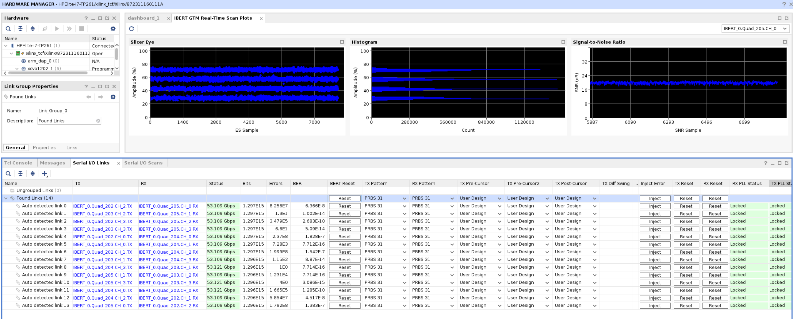
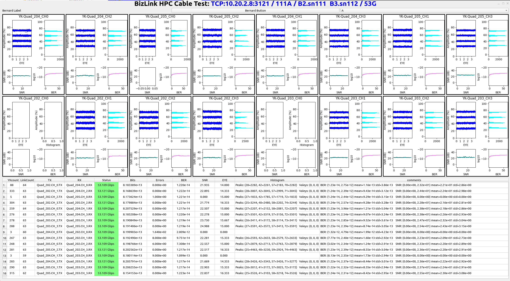
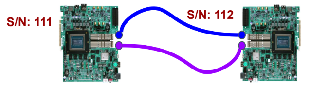
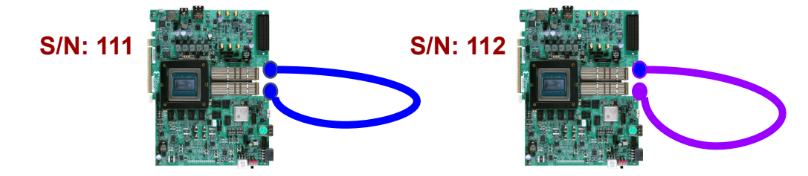
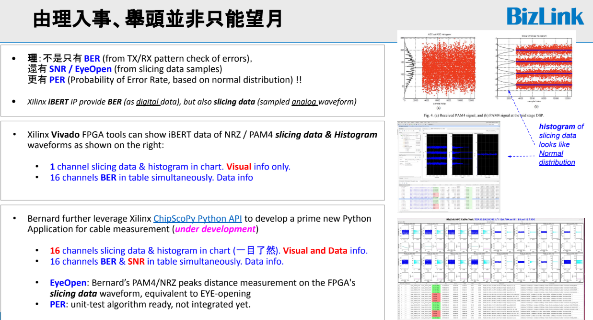
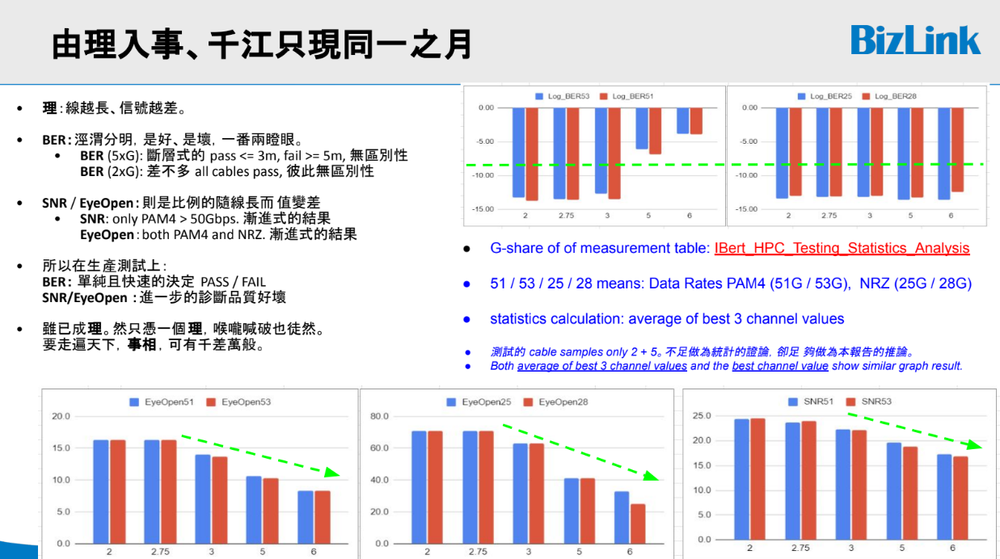

# High Speed Cable testing python application on Xilinx FPGA / iBERT-IP

## Description

### Based technologies

- [AMD Versal™ Premium Series VPK120 Evaluation Kit](https://www.amd.com/en/products/adaptive-socs-and-fpgas/evaluation-boards/vpk120.html)
- In-System IBERT IP (installed through Vivado)
- [ChipScoPy Python for Xilinx hardware debug solutions](https://xilinx.github.io/chipscopy/2025.1/index.html)

### GUI for SNR/BER measurement of HPC cables - Xilinx Vivado

- Xilinx way to check BER/SNR performance - Vivado
  - 16 entries table to show BER of QSFP-DD cable channels simultaneously
  - 1 figure to show SNR, slicer eye diagram, histogram, one-by-one by manually selection

### GUI for SNR/BER measurement of HPC cables - This python application

- Python application for Multichannel High Speed Cable testing, based on Xilinx CHipScoPy to access in-system iBERT realtime measured data (BER, datarate, etc.)
  - Currently supports QSFP-DD. But can be applied to OSFP-DD, and others as well.
  - This application leverage Xilinx VPK120, which supports 112G per channel.

- GUI comparison vs Vivado
  - 16 entries table to show BER of QSFP-DD cable channels simultaneously (similar to Vivado, with more columns)
  - 16 figures to show SNR, slicer eye diagram, histogram, simultaneously (significantly better than Vivado)

## Test setup

- For below testing videos, they applied 'self loop connection'

### cross connection for 2 cables on 2 VPK120 board, jointly

### self loop connection for 2 cables on 2 VPK120 board, respectively

## Execution results

### Test Report of Measurement result

### Youtube videos: Same cable pairs (A1 vs B1) at different rates (106G to 10G)

- [vpk120_ibert 2024-06-19 A1.sn111_B1.sn112 ChipScoPy-106G](https://www.youtube.com/watch?v=0q_JrXw55CI)
- [vpk120_ibert 2024-06-19 A1.sn111_B1.sn112 ChipScoPy-56G](https://www.youtube.com/watch?v=eHCbUxkYKbI)
- [vpk120_ibert 2024-06-19 A1.sn111_B1.sn112 ChipScoPy-53G](https://www.youtube.com/watch?v=mV0R3NWcBVM)
- [vpk120_ibert 2024-06-19 A1.sn111_B1.sn112 ChipScoPy-51G](https://www.youtube.com/watch?v=n3pv9-3KCpY)
- [vpk120_ibert 2024-06-19 A1.sn111_B1.sn112 ChipScoPy-25G](https://www.youtube.com/watch?v=BYdLWb7Fs6A)
- [vpk120_ibert 2024-06-19 A1.sn111_B1.sn112 ChipScoPy-10G](https://www.youtube.com/watch?v=20zd3dXQ3IE)

### Youtube videos: Comparison of This multichannel ChipScopy application, vs. Xilinx Vivado, on 53G per channel

- [vpk120_ibert 2024-06-19 A1.sn111_B1.sn112 ChipScoPy-Vivado-53G](https://www.youtube.com/watch?v=PdGcgPNZXZU)
- [vpk120_ibert 2024-06-19 A1.sn111_B1.sn112 Vivado-ChipScoPy-53G](https://www.youtube.com/watch?v=rl_kp8WlaEY)

### Youtube videos: Comparison of This multichannel ChipScopy application, vs. Xilinx Vivado, on 28G per channel

- [vpk120_ibert 2024-06-19 A1.sn111_B1.sn112 Vivado-ChipScoPy-28G](https://www.youtube.com/watch?v=MQyHBQEJZTs)
- [vpk120_ibert 2024-06-19 A1.sn111_B1.sn112 ChipScoPy-Vivado-28G](https://www.youtube.com/watch?v=sDNRpD9tSEA)
